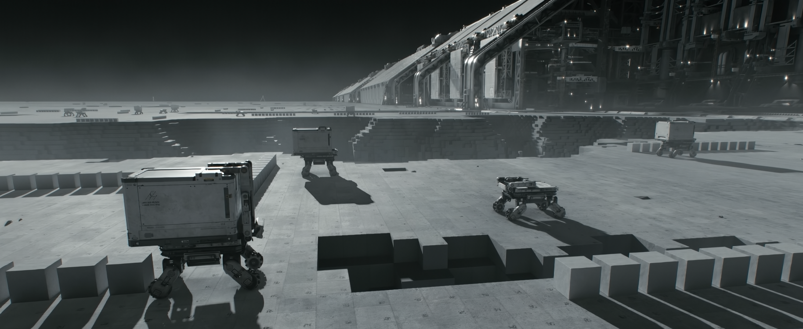

# FutureRobotics2098

A brief history of Future Robotics.

Future Robotics 2098 | 未来机器人简史​

「从工具到共生体：重写机器人的未来简史」​

本专栏以"机器人即生产力革命"为内核，探索从工业机械臂到星际自主系统的演化路径。突破"拟人化"局限，定义广义机器人——​​能感知、决策并改造物理世界的智能体​​。结合AI、仿生学与太空探索需求，推演2098年人机协同的终极形态：机器不再替代人类，而是拓展文明边界的新物种。

---

## 📚 目录导航

### 📖 已发布章节（内测）

- [📝 题记](content/题记.md) - 从工具到伙伴的哲学思考
- [🧬 第一章：机器人基础科学](content/1机器人基础科学.md) - 材料、机械、电气、AI的革命性突破
- [👁️ 第二章：机器人感知与认知](content/2机器人感知与认知.md) - 从简单传感到智能理解的飞跃

*🎯 持续更新中...敬请关注*
